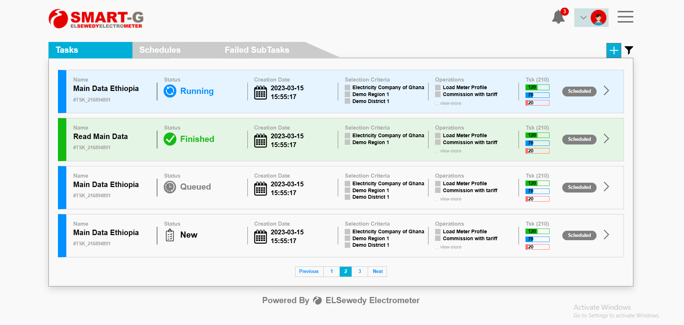

# Tasks Management Screen



## Overview
This project is a user interface for a task management screen developed using HTML and CSS. The interface displays a list of tasks with the ability to filter and organize them by status.

## Key Features

### 🎯 Task Management
- Display comprehensive task list with details
- Categorize tasks by status (Running, Finished, Queued, New)
- Show task progress using colored progress bars
- Pagination system for navigating between tasks

### 📊 Task Information
- **Task Name**: With unique task identifier
- **Status**: Running, Finished, Queued, New
- **Creation Date**: Date and time
- **Selection Criteria**: List of applied criteria
- **Operations**: List of required operations
- **Progress**: Colored progress bars (green, blue, red)

### 🎨 Design & Interface
- Responsive design supporting all screen sizes
- Consistent and professional color scheme
- Descriptive icons for each task status
- Organized grid layout for information

## Project Structure

```
├── index.html          # Main page
├── global.css          # Main stylesheet
├── image/              # Images and icons folder
│   ├── Logo New.png
│   ├── avatar-svgrepo-com.png
│   └── *.svg           # Various icons
└── README.md           # This file
```

## Technologies Used

- **HTML5**: Page structure
- **CSS3**: Design and styling
  - CSS Grid for layout
  - CSS Variables for colors
  - Media Queries for responsive design

## Supported Statuses

| Status | Color | Description |
|--------|-------|-------------|
| Running | Blue | Task is currently running |
| Finished | Green | Task is completed |
| Queued | Gray | Task is in queue |
| New | Black | New task |

## Responsive Design

The project supports the following screen sizes:
- **Desktop**: 1320px and larger
- **Tablet**: 992px - 1300px
- **Small Tablet**: 769px - 991px
- **Mobile**: 768px and below
- **Small Mobile**: 480px and below

## How to Run

1. Download all files
2. Open `index.html` in a web browser
3. The task management screen will be ready to use

## Customization

### Colors
You can customize colors by modifying CSS variables at the beginning of `global.css`:

```css
:root {
    --color-primary: #0090ff;      /* Primary color */
    --color-success: #12bb12;      /* Success color */
    --color-queued: #808080;       /* Queued color */
    --color-new: #000000;          /* New color */
    /* ... more colors */
}
```

### Adding New Tasks
You can add new tasks by copying the `task-card` structure in `index.html` and modifying the data.


## Requirements

- Modern web browser supporting HTML5 and CSS3
- No external libraries required

## License

All rights reserved to Seif Ahmed.

---

**Developed by**: Seif Ahmed
**Last Updated**: 2025
